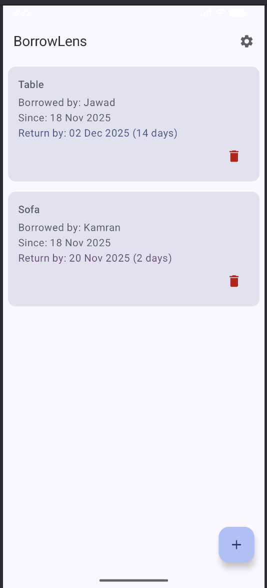
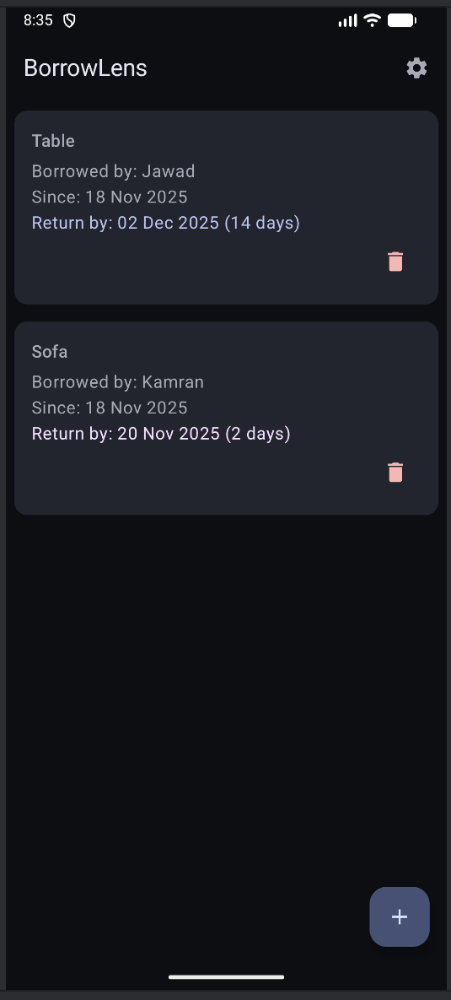
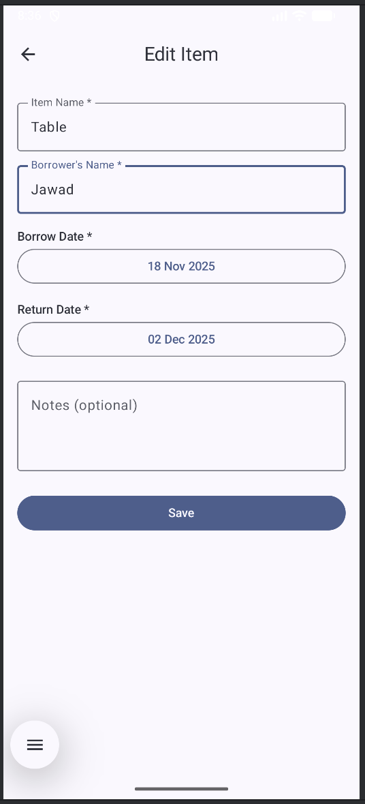
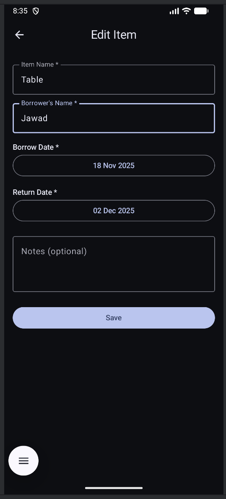
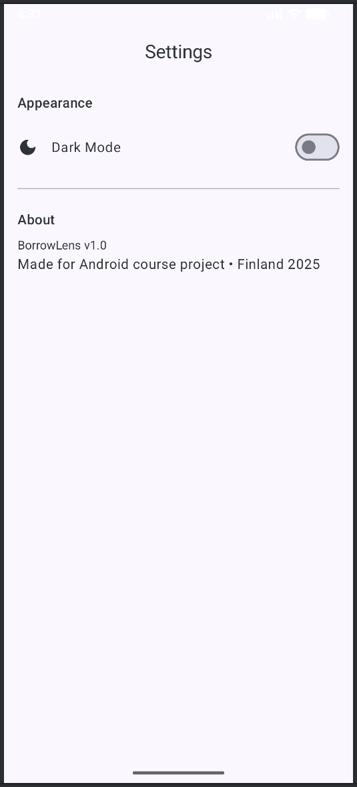
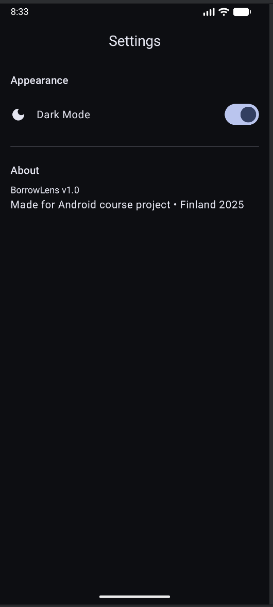

# BorrowLens – Never Forget What You Lent  

[](https://github.com/HammadKhalid75/BorrowLens/releases/latest/download/app-release.aab)
[](https://kotlinlang.org)
[](https://developer.android.com/compose)

**BorrowLens** is a clean, modern Android app built with **100% Jetpack Compose** to track items you lend or borrow — never lose track again!

## Features

- Real **Material 3 Date Pickers** for borrow & return dates  
- **Return date required** + overdue warning (red), soon-due (orange)  
- Full **dark/light mode toggle** in Settings (saved forever)  
- Clean, responsive Material You design  
- Instant search & smooth animations  
- Built with modern architecture (MVVM + Room + Flow + Koin)

## Tech Stack

- **Language**: Kotlin 100%  
- **UI**: Jetpack Compose + Material 3  
- **Architecture**: MVVM + Repository Pattern  
- **Database**: Room + Kotlin Flow + StateFlow  
- **DI**: Koin  
- **Preferences**: DataStore  
- **Navigation**: Compose Navigation  

## Screenshots

<div align="center">




<br>




<br>





</div>

## How to Run the Project

Follow these simple steps to run BorrowLens on your own computer:

1. **Clone the repository**
   ```bash
   git clone https://github.com/HammadKhalid75/BorrowLens.git
   cd BorrowLens
   ```
2.  **Open the project in Android Studio**
    - Launch Android Studio (Iguana 2023.3.1 or newer recommended)
    - Choose "Open an existing project"
    - Select the BorrowLens folder you just cloned

3. **Wait for Gradle sync**
    - Android Studio will automatically download all dependencies
    - You’ll see “Gradle sync finished” in the bottom bar (takes 1–3 minutes the first time)

4. **Connect a phone or start an emulator**
    - Enable Developer Options + USB Debugging on your Android phone, OR
    - Open AVD Manager → Create/start a virtual device (Pixel 6, API 34 recommended)

5. **Run the app**
    - Click the green Run button (or press Shift + F10)
    - Choose your phone/emulator → wait a few seconds → BorrowLens will launch!

You now have the fully working app running locally.

## License
[](LICENSE)

This project is licensed under the MIT License – see the LICENSE file for details.

Made with love in Finland — November 2025

**Hammad Khalid**
